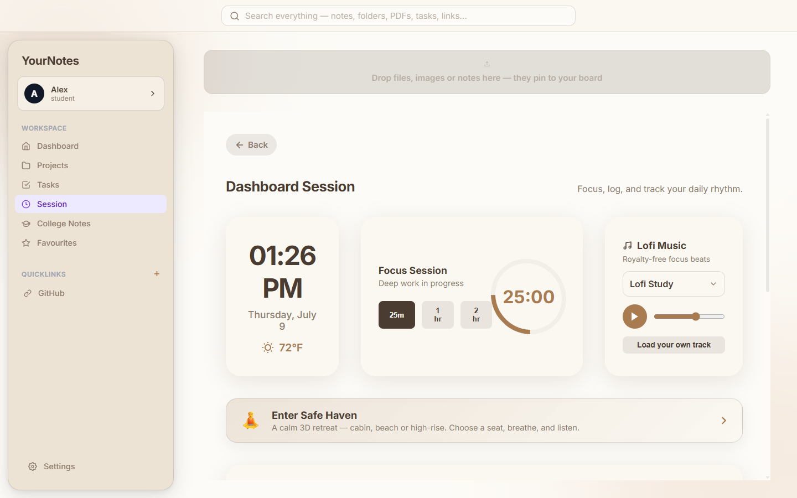

<div align="center">
  
  <h1>YourNotes</h1>
  <p><b>My personal productivity workspace</b> — notes, tasks, college PDFs, a focus session with lofi, and an expense tracker, all in one calm desktop app.</p>
  <p>
    
    
    
    
  </p>
</div>

## Why this exists

I really liked [OpenNotes](https://github.com/rajsriv/OpenNotes) by [@rajsriv](https://github.com/rajsriv) but it wasn't being maintained, so — since it's MIT — I forked it into **YourNotes** and made it mine. I rebuilt it into a proper Windows app, dropped the stuff I didn't use, and added the features I actually wanted day to day.

Built and maintained by **[@BlazinSan](https://github.com/BlazinSan)**.

## What I changed from the original

- 🪟 **Proper desktop app** — hardened Electron build (CSP, sandbox, no menu-bar chrome), packaged as a Windows installer.
- 🎛️ **Custom themed dropdowns** everywhere (no more ugly OS pickers), with subtle themed scrollbars.
- 🌍 **Multi-language UI** — English, العربية (RTL), 中文, and Bahasa Melayu.
- 💱 **Every world currency** (full ISO 4217 list) in the expense tracker.
- 🌡️ **Fahrenheit / Celsius** toggle.
- 🎧 **Lofi music player** sitting right next to the Focus Session — royalty-free streams or load your own track.
- 🔙 **Back button on every page** and one consistent theme throughout.
- 🧹 Removed the dynamic-island notch, cleaned up the settings page, and made saving reliable.

## Core features

- **Notes & wiki-links** — markdown shortcuts, `[[linking]]`, and a live graph map of how notes connect.
- **Tasks, Calendar, Habits, Goals & Books** — plan deadlines and track streaks in one place.
- **College Notes** — import multiple lecture PDFs into subject folders and read them fullscreen.
- **Focus Session** — pomodoro timer, daily mood log, expense tracker, and the lofi player.
- **Dark & Light themes** — warm, paper-inspired palette.

## Gallery

<table align="center">
  <tr>
    <td align="center" width="50%">
      
      <br><b>Dashboard & Graph Map</b><br>
      <i>A bird's-eye view of every note and project.</i>
    </td>
    <td align="center" width="50%">
      
      <br><b>Focus Session + Lofi</b><br>
      <i>Timer, daily log, expenses, and royalty-free lofi.</i>
    </td>
  </tr>
  <tr>
    <td align="center">
      
      <br><b>Tasks, Calendar & Habits</b><br>
      <i>Deadlines, habits, goals, and project tracking.</i>
    </td>
    <td align="center">
      
      <br><b>Settings</b><br>
      <i>Language, °F/°C, every currency, and themes.</i>
    </td>
  </tr>
  <tr>
    <td align="center">
      
      <br><b>College Notes</b><br>
      <i>Subject folders for your lecture PDFs.</i>
    </td>
    <td align="center">
      
      <br><b>Dark Mode</b><br>
      <i>Easy on the eyes for late-night sessions.</i>
    </td>
  </tr>
</table>

## Install (Windows)

Grab the latest **`YourNotes Setup x.x.x.exe`** from the [Releases](../../releases) page and run it. The build isn't code-signed yet, so Windows SmartScreen may warn you — click **More info → Run anyway**. There's also a portable `.exe` if you'd rather not install.

## Build from source

```bash
git clone https://github.com/BlazinSan/YourNotes.git
cd YourNotes
npm install
npm run electron:dev   # run in dev
npm run package        # build the Windows installer (release/)
```

## Credits

Forked from [OpenNotes](https://github.com/rajsriv/OpenNotes) by [@rajsriv](https://github.com/rajsriv), licensed MIT. Thanks for the great starting point.

## License

MIT © [@BlazinSan](https://github.com/BlazinSan)
