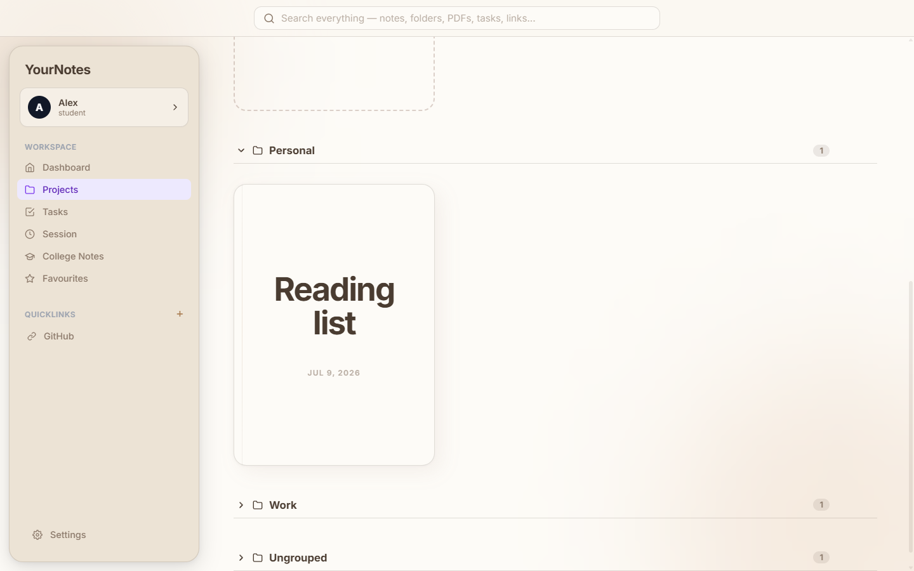
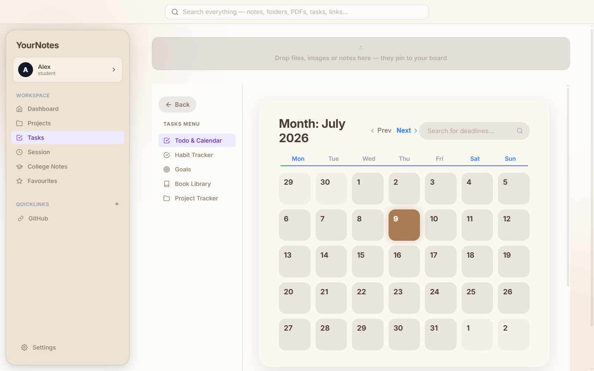
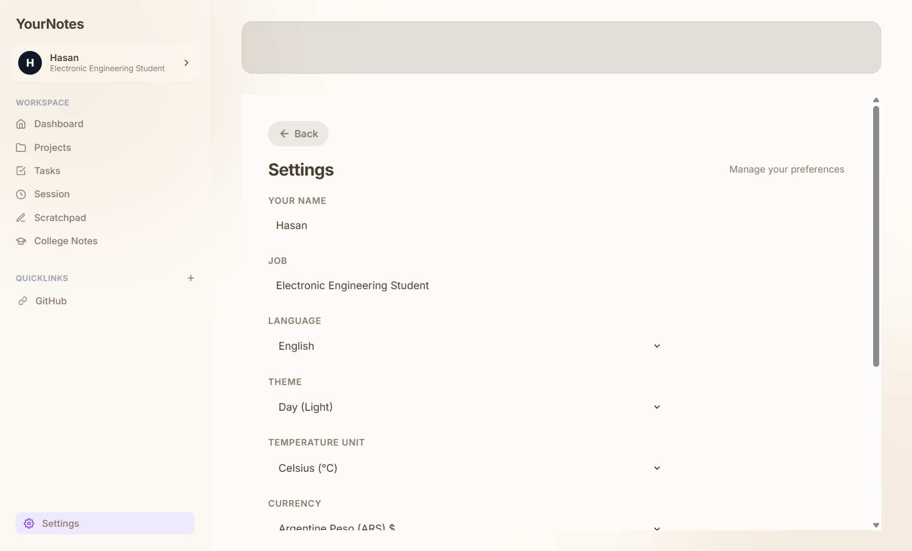
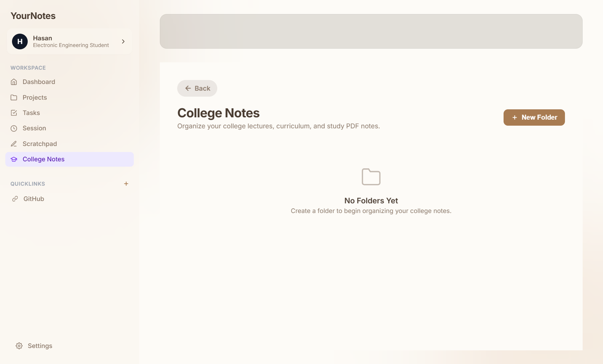
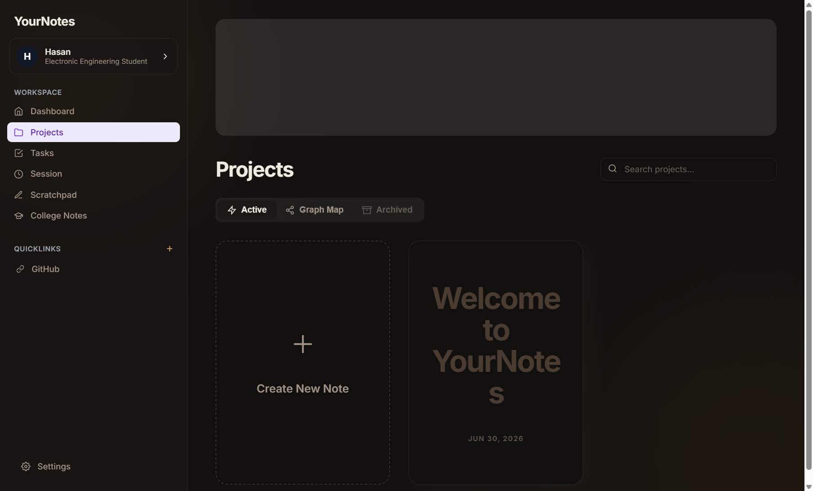

<div align="center">
  
  <h1>YourNotes</h1>
  <p><b>Your calm, productivity realm for Windows and Android.</b></p>
  <p>Capture notes, organize projects, plan tasks, study PDFs, focus with lofi, and unwind in Safe Haven—without turning your workspace into clutter.</p>
  <p>
    
    
    
    
    
    
  </p>
</div>

## What YourNotes is

YourNotes is a maintained, deeply expanded fork of [OpenNotes](https://github.com/rajsriv/OpenNotes) by [@rajsriv](https://github.com/rajsriv). It has grown into a cross-platform workspace designed around fast capture, visual organization, reliable local storage, and an interface that feels warm rather than clinical.

Your data stays on the device by default. Account sync is optional, and uploaded files are stored in Cloudflare R2 rather than consuming Convex file storage.

Built and maintained by **[@BlazinSan](https://github.com/BlazinSan)**.

## Highlights

- 📝 **Notes that connect** — a focused editor, wiki-style links, project folders, favourites, archive/trash flows, exports, and a sortable project-note sidebar.
- 🕸️ **Project-aware Graph Map** — see how notes relate, with distinct colors for every project or folder so larger knowledge bases stay readable.
- 📌 **Spatial dashboard board** — pin notes, images, PDFs, videos, and other files; drag and resize them while the layout keeps items in bounds and prevents overlap across desktop and phone.
- 🧘 **Safe Haven** — switch between an atmospheric log cabin, beach retreat, and high-rise loft, choose viewpoints, control ambience, and play the same lofi tracks used by Focus Session.
- 🎯 **Planning in one place** — tasks, calendar, habits, goals, books, expenses, and a Pomodoro-style focus session.
- 🙂 **Interactive daily mood log** — phone-friendly mood history, tap-to-view entries, responsive writing space, and dated journal details.
- 🎓 **College Notes** — organize lecture PDFs by subject and read them in a dedicated full-screen viewer.
- ☁️ **Optional cross-device sync** — sync notes, preferences, PDFs, pictures, and board files between Windows and Android; large file bodies go to Cloudflare R2.
- 🌍 **Personalized workspace** — English, العربية (RTL), 中文, and Bahasa Melayu; light/dark themes; Celsius/Fahrenheit; and the full ISO 4217 currency list.
- ⚡ **Chrome Quick Portal** — capture thoughts, selected text, page links, and URLs from the browser, with shortcuts back into the full app.

## Designed for desktop and phone

The Windows build opens maximized and provides the full desktop workspace. The Android build uses phone-specific navigation, touch targets, text fields, mood history, dashboard behavior, media viewers, and Safe Haven controls instead of simply shrinking the desktop layout.

The app is local-first and continues to work without signing in. Account sync is opt-in and can be triggered explicitly from Settings.

## Gallery

<table align="center">
  <tr>
    <td align="center" width="50%">
      
      <br><b>Dashboard</b><br>
      <i>A visual home for your workspace and pinned items.</i>
    </td>
    <td align="center" width="50%">
      
      <br><b>Focus Session + Lofi</b><br>
      <i>Timer, daily log, mood history, expenses, and music.</i>
    </td>
  </tr>
  <tr>
    <td align="center">
      
      <br><b>Tasks, Calendar & Habits</b><br>
      <i>Plan deadlines, routines, goals, and projects.</i>
    </td>
    <td align="center">
      
      <br><b>Settings & Sync</b><br>
      <i>Personalize the app and optionally keep devices together.</i>
    </td>
  </tr>
  <tr>
    <td align="center">
      
      <br><b>College Notes</b><br>
      <i>Subject folders and a dedicated lecture-PDF workflow.</i>
    </td>
    <td align="center">
      
      <br><b>Dark Mode</b><br>
      <i>A warm, low-glare workspace for late sessions.</i>
    </td>
  </tr>
</table>

## Install

Download the latest build from [GitHub Releases](../../releases/latest).

### Windows

Run **`YourNotes Setup x.x.x.exe`**, or use the portable `.exe`. The builds are not code-signed yet, so Windows SmartScreen may ask for confirmation; choose **More info → Run anyway** if you downloaded the file from this repository.

### Android

Download the release APK, allow installation from your browser or file manager when Android asks, and install it. Android 7.0 (API 24) or newer is required.

### Chrome Quick Portal

The extension currently installs unpacked:

1. Download or clone this repository.
2. Open `chrome://extensions` and enable **Developer mode**.
3. Choose **Load unpacked** and select the `chrome-extension` folder.

Quick captures remain in Chrome's local extension storage. Features that need the complete data model direct you to the full app.

## Build from source

Requirements: a current Node.js/npm installation; Android Studio and a compatible JDK are additionally required for Android builds.

```bash
git clone https://github.com/BlazinSan/YourNotes.git
cd YourNotes
npm install

npm run electron:dev   # desktop development
npm run build          # production web bundle
npm run package        # Windows installer + portable build in release/

npx cap sync android   # copy the web bundle into the Android project
cd android
./gradlew assembleDebug
```

## Privacy and storage

- Notes and settings are saved locally unless you choose to sign in and sync.
- Convex provides authentication and structured synchronization metadata.
- Cloudflare R2 stores uploaded file bodies and larger binary content.
- Safe Haven assets and bundled audio attributions are documented under `public/haven-assets` and `public/audio/lofi`.

## Credits

Forked from [OpenNotes](https://github.com/rajsriv/OpenNotes) by [@rajsriv](https://github.com/rajsriv), licensed under MIT. Third-party model, texture, and audio credits are included beside their respective assets in the repository.

## License

MIT © [@BlazinSan](https://github.com/BlazinSan)
