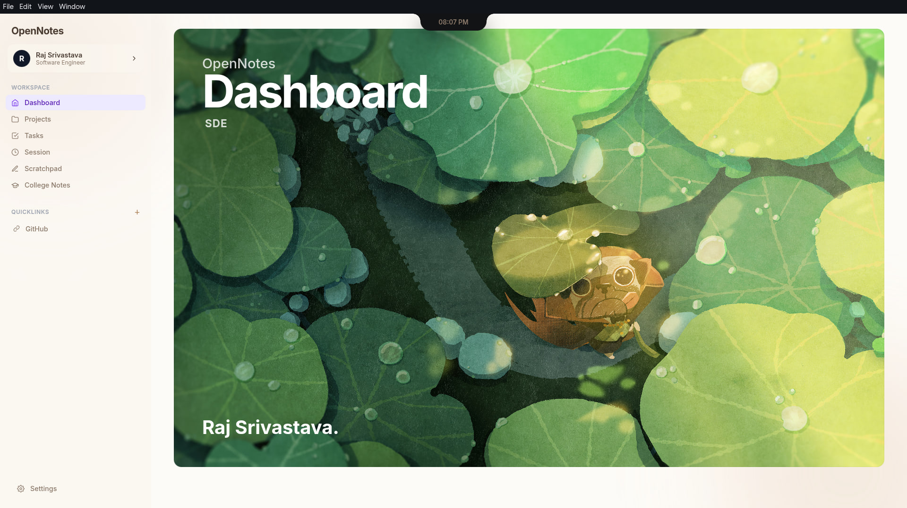
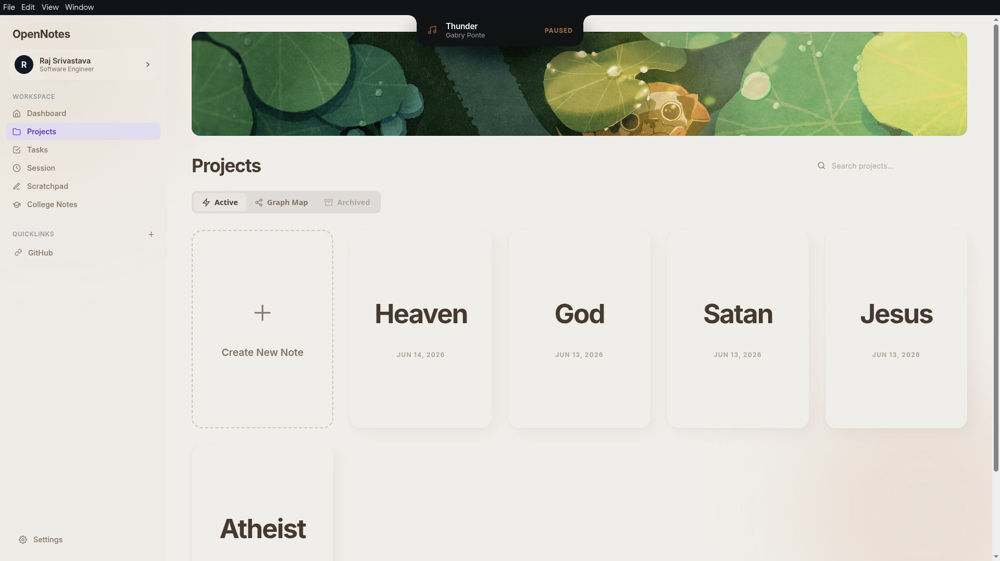
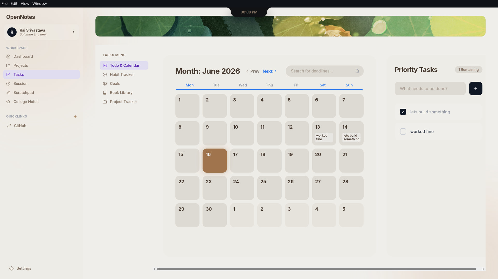
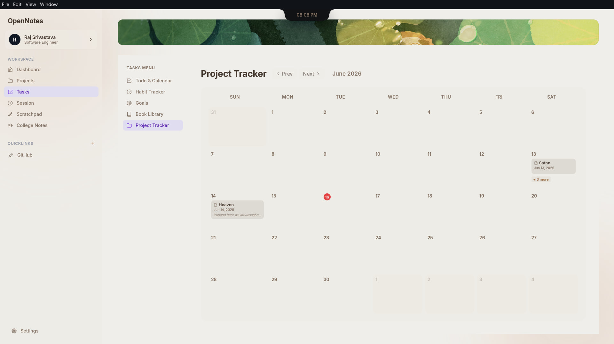
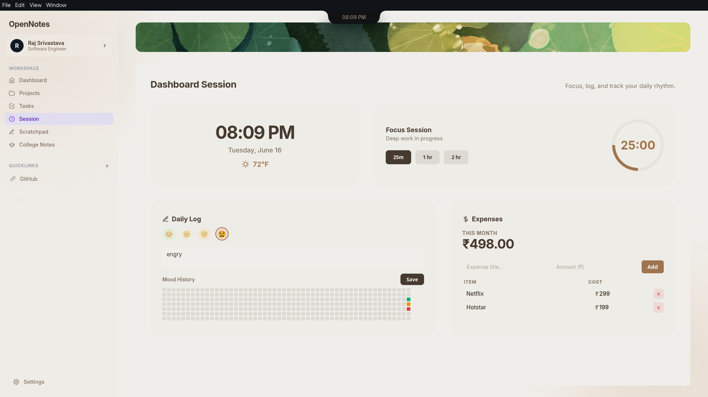
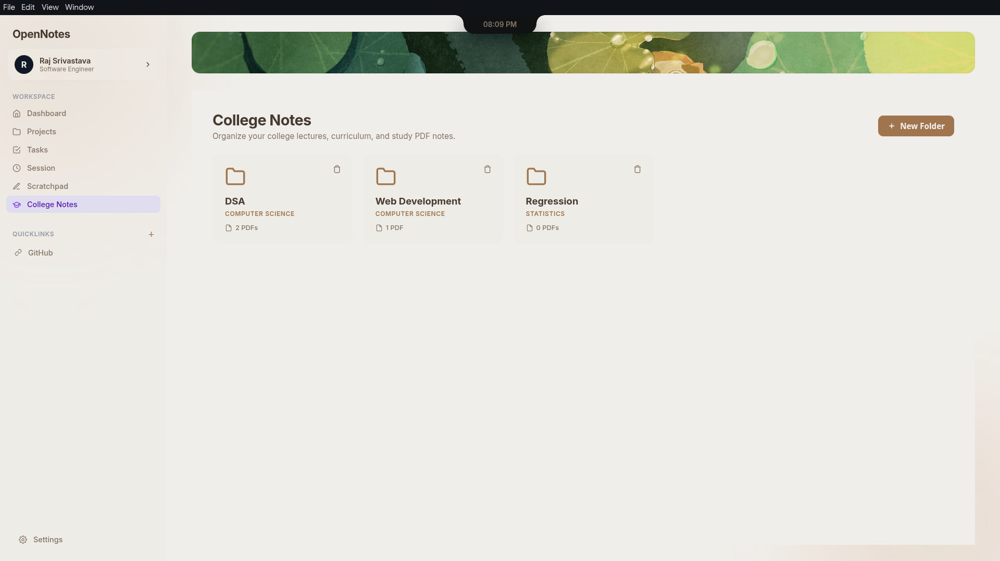
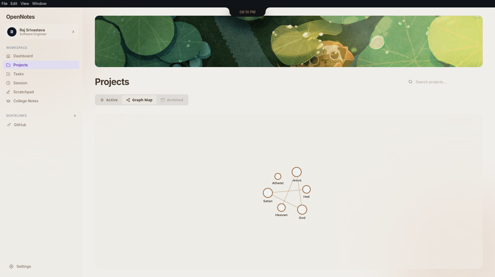
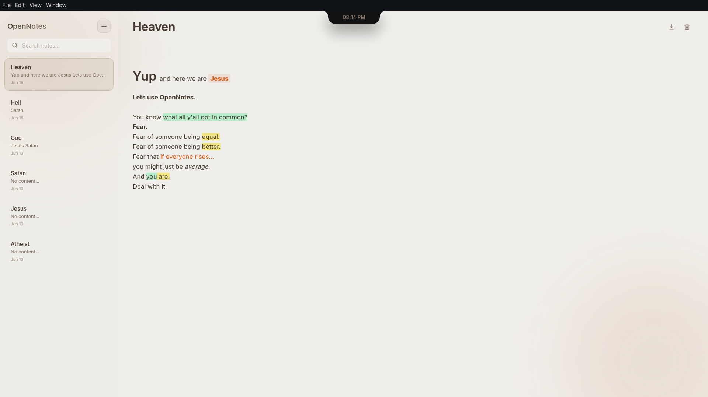

<div align="center">
  
  <h1>OpenNotes</h1>
  <p>A beautiful, modern, cross-platform productivity workspace and note-taking application designed to keep your tasks, projects, college notes, and habits organized.</p>
  <p>
    
    
    
    
    
  </p>
</div>

## Features
- **Project & Task Tracker:** Organize your daily priorities, habits, and tasks.
- **College Notes Organizer:** Import PDF lecture notes and organize them into subject folders. 
- **Built-in Document Viewer:** View your PDFs or rich-text notes in a beautiful fullscreen experience.
- **Cross-Platform:** Available on Linux, Windows, and macOS.
- **Dark & Light Themes:** Premium design that adapts to your system preferences.

## Gallery

Experience the premium design and powerful features of OpenNotes:

<table align="center">
  <tr>
    <td align="center" width="50%">
      
      <br>
      <b>Dashboard & Overview</b><br>
      <i>Get a bird's-eye view of your daily tasks, recent notes, and ongoing projects.</i>
    </td>
    <td align="center" width="50%">
      
      <br>
      <b>Project & Task Tracker</b><br>
      <i>Organize your workflow with structured kanban boards and actionable to-do lists.</i>
    </td>
  </tr>
  <tr>
    <td align="center">
      
      <br>
      <b>College Notes Organizer</b><br>
      <i>Sort and manage your academic materials effortlessly using subject folders.</i>
    </td>
    <td align="center">
      
      <br>
      <b>PDF Document Viewer</b><br>
      <i>Read and review your PDF textbooks and lecture slides seamlessly.</i>
    </td>
  </tr>
  <tr>
    <td align="center">
      
      <br>
      <b>Rich Text Editor</b><br>
      <i>Format your text beautifully with our built-in premium rich text tools.</i>
    </td>
    <td align="center">
      
      <br>
      <b>Fullscreen Experience</b><br>
      <i>Eliminate distractions and immerse yourself completely in your reading or writing.</i>
    </td>
  </tr>
  <tr>
    <td align="center">
      
      <br>
      <b>Dark Mode</b><br>
      <i>A sleek, high-contrast dark theme designed to reduce eye strain.</i>
    </td>
    <td align="center">
      
      <br>
      <b>Light Mode</b><br>
      <i>A clean, vibrant light theme for an energizing daytime workspace.</i>
    </td>
  </tr>
</table>

---

## Installation Guide: Which file should I download?

Go to the [Releases](../../releases) page to download the latest version. Depending on your operating system, download the corresponding file:

### 🐧 Linux Users
* **`.AppImage`**: The easiest option for most Linux distributions. Download it, make it executable (`chmod +x`), and double-click to run. No installation required.
* **`.deb`**: Download this if you are using **Debian, Ubuntu, Linux Mint**, or Pop!_OS.
* **`.rpm`**: Download this if you are using **Fedora, CentOS, RHEL**, or openSUSE.
* **`.pacman`**: Download this if you are using **Arch Linux, Manjaro**, or EndeavourOS.

### 🪟 Windows Users
* **`.exe` (Setup / Installer)**: Download this standard installer. Double-click it to install OpenNotes on your Windows PC.

### 🍎 macOS Users
* **`.zip` (macOS)**: Download and extract this file to get the macOS application. Drag it to your Applications folder.

---

## Development

If you want to build the project from source:

1. Clone the repository:
   ```bash
   git clone https://github.com/rajsriv/OpenNotes.git
   cd OpenNotes
   ```

2. Install dependencies:
   ```bash
   npm install
   ```

3. Run the development server:
   ```bash
   npm run electron:dev
   ```

4. Package for production (All Platforms):
   ```bash
   ./build-all.sh
   ```

## License
MIT
